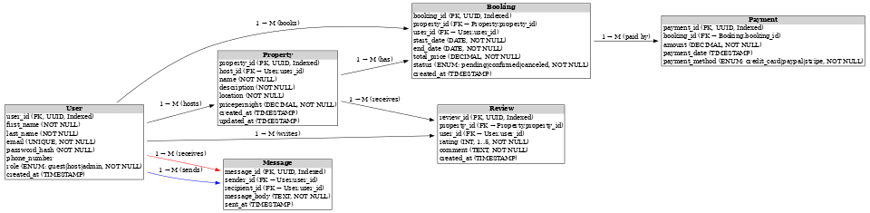

# Entity-Relationship Diagram (ERD) for AirBnB Database

## 1. Objective
The goal of this task is to design an **Entity-Relationship Diagram (ERD)** for the AirBnB database.  
This ERD captures the entities, attributes, and relationships needed to support core features such as user management, property listings, bookings, payments, reviews, and messaging.

---

## 2. Entities and Attributes

### **User**
- **user_id** (PK, UUID, Indexed)  
- first_name (VARCHAR, NOT NULL)  
- last_name (VARCHAR, NOT NULL)  
- email (VARCHAR, UNIQUE, NOT NULL)  
- password_hash (VARCHAR, NOT NULL)  
- phone_number (VARCHAR, NULL)  
- role (ENUM: guest, host, admin, NOT NULL)  
- created_at (TIMESTAMP, DEFAULT CURRENT_TIMESTAMP)  

---

### **Property**
- **property_id** (PK, UUID, Indexed)  
- host_id (FK → User.user_id)  
- name (VARCHAR, NOT NULL)  
- description (TEXT, NOT NULL)  
- location (VARCHAR, NOT NULL)  
- pricepernight (DECIMAL, NOT NULL)  
- created_at (TIMESTAMP, DEFAULT CURRENT_TIMESTAMP)  
- updated_at (TIMESTAMP, ON UPDATE CURRENT_TIMESTAMP)  

---

### **Booking**
- **booking_id** (PK, UUID, Indexed)  
- property_id (FK → Property.property_id)  
- user_id (FK → User.user_id)  
- start_date (DATE, NOT NULL)  
- end_date (DATE, NOT NULL)  
- total_price (DECIMAL, NOT NULL)  
- status (ENUM: pending, confirmed, canceled, NOT NULL)  
- created_at (TIMESTAMP, DEFAULT CURRENT_TIMESTAMP)  

---

### **Payment**
- **payment_id** (PK, UUID, Indexed)  
- booking_id (FK → Booking.booking_id)  
- amount (DECIMAL, NOT NULL)  
- payment_date (TIMESTAMP, DEFAULT CURRENT_TIMESTAMP)  
- payment_method (ENUM: credit_card, paypal, stripe, NOT NULL)  

---

### **Review**
- **review_id** (PK, UUID, Indexed)  
- property_id (FK → Property.property_id)  
- user_id (FK → User.user_id)  
- rating (INTEGER, CHECK: 1–5, NOT NULL)  
- comment (TEXT, NOT NULL)  
- created_at (TIMESTAMP, DEFAULT CURRENT_TIMESTAMP)  

---

### **Message**
- **message_id** (PK, UUID, Indexed)  
- sender_id (FK → User.user_id)  
- recipient_id (FK → User.user_id)  
- message_body (TEXT, NOT NULL)  
- sent_at (TIMESTAMP, DEFAULT CURRENT_TIMESTAMP)  

---

## 3. Relationships

- **User → Property**: One user (host) can list many properties.  
- **User → Booking**: One user (guest) can make many bookings.  
- **Property → Booking**: A property can have many bookings.  
- **Booking → Payment**: A booking can have one or more payments.  
- **User → Review → Property**:  
  - A user can write many reviews.  
  - A property can receive many reviews.  
- **User → Message → User**:  
  - A user can send and receive many messages from other users.  

---

## 4. ER Diagram

The diagram below shows the entities, attributes, and relationships:  

*(Generated using Draw.io / diagrams.net)*  

---

## 5. Notes
- **Primary keys** are indexed automatically.  
- Additional indexes are created on:  
  - `User.email`  
  - `Property.property_id` and `Booking.property_id`  
  - `Booking.booking_id` and `Payment.booking_id`  
- The schema is designed for **normalization** to reduce redundancy and ensure data integrity.  
- Some denormalization may be considered later for performance optimization.  